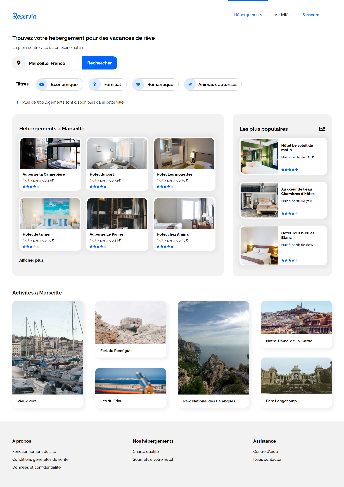

# 2021  -  Reservia

### Intégration d'une maquette d'un site web en HTML5 et CSS3 pour la planification de vacances "Reservia"

&nbsp;

La maquette réalisée par mes soins
 
**Maquette demandée par la société 

 </img>
 </img>

### Élements à respecter

- Une maquette desktop et une maquette mobile. 
- Police : Raleway 
- Icônes : Provenant de la bibliothèque de Font Awesome 
- Couleurs : bleu #0065FC, bleu clair #DEEBFF  et gris #F2F2F2.
- Le logo ainsi que toutes les images du site en version sm, md, L et XL.
 

### Contraintes techniques

- HTML et CSS uniquement. 
- Le site doit être responsive et adaptable parfaitement sur mobile.
- Adaptations au choix sur les tablettes du moment qu'aucun élément n'est coupé et que le texte a une taille suffisante. 
- Dans le menu, les liens “Hébergements” et “Activités” sont des ancres qui doivent mener aux sections de la page.
- Le champ de recherche doit être un champ de saisie, dont le texte peut être édité par l'usager mais les boutons ne seront à ce stade pas fonctionnels.
- Chaque carte d’hébergement ou d’activité devra être cliquable dans son intégralité. Pour l’instant les liens seront vides.
- Les filtres ne seront pas fonctionnels mais il faut qu'ils changent d'apparence au survol.
- Les images doivent bien s'adapter et ne pas impacter le temps de chargement de la page.
- Le site devra être compatible avec les dernières versions de Chrome et Firefox.

### Lien vers Github Page : https://oliviercos.github.io/OlivierCostel_2_14042021/
